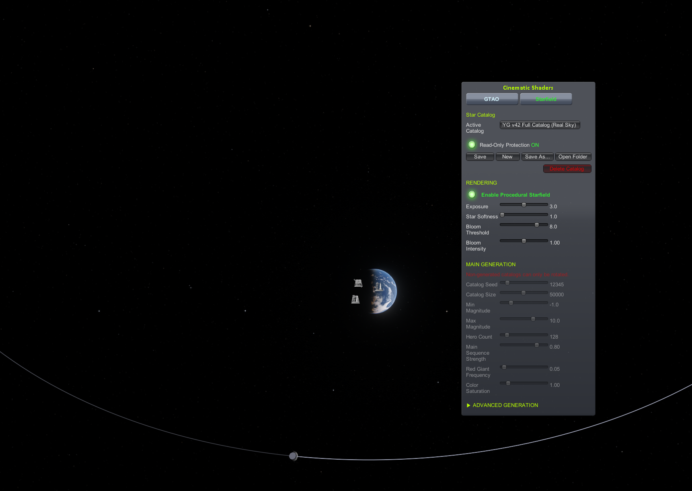
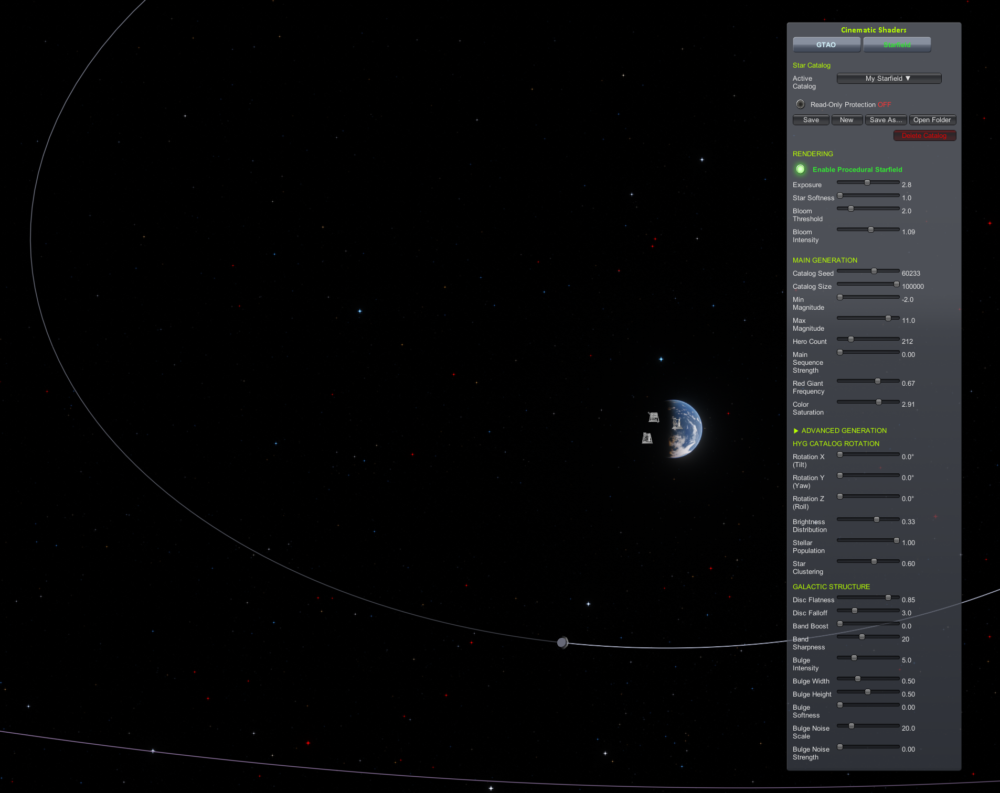

A shader mod for Kerbal Space Program 1.12 - GTAO and Starfield currently available, more planned...

## Available Shaders

- **GTAO (Ground-Truth Ambient Occlusion)** – Horizon-based occlusion with normal-aware filtering
- **Starfield Catalog** - Catalog-based GPU-rendered stars.  No PNG, no pixelation.

## Screenshots and Comparisons

### GTAO 

Note that GTAO may not provide the more dramatic, soft shadows MSVO can - you can enable both, and use both, if you want!  MSVO exposed by [TUFX](https://github.com/KSPModStewards/TUFX) for KSP.

Here you can see the difference between Cinematic Shaders GTAO and the AO provided through ReShade and the MXAO shader.  The MXAO shader is an amazing piece of work, it can provide GTAO across a wide array of titles.  The comparison here is to highlight the fact that it's easier to pull off the effect in-engine because you can get the right data from the engine directly.  MXAO rebuilds that data after the fact, inferring it from the scene - a huge technical hurdle I didn't have to cross.

### Starfield Shader

## What is it? ##
This mod completely overhauls the stock Galaxy Camera, replacing the static skybox with a fully rendered catalog-based starfield. No textures are used to define the stars—the stars are generated mathematically and rendered in real-time using your GPU.

**Star Catalogs**
The starfield is driven by catalogs that define each star's position, brightness, and color. You can choose from several "real star" catalogs based on actual astronomical data from the Hipparcos satellite courtesy of the ESA, or generate your own custom starfield using the procedural generation controls.

Save and share your creations easily! All catalogs are stored as `.bin` files in the `PluginData\StarCatalogs` folder and can be shared with other players.

**Important Note**
The stars will **not** be visible on the Main Menu. You must load into a game (Space Center, Flight, or Tracking Station) to see the starfield.

Here's a shot of the real star catalog

Or you can make your own starfield as wild and colourful as you want it using the sliders to customize the look and feel to your preference

## Requirements

- **KSP 1.12.x**
- **[Deferred](https://github.com/LGhassen/Deferred)** – Required for effects to function.

## Installation

Unzip the archive into your `Kerbal Space Program/` folder.

The folder structure should be: `GameData/CinematicShaders/`

## GTAO Usage

1. **Open UI**: Click the wireframe sphere icon on the toolbar
2. **Enable**: Check "Enable Ground-Truth AO" in the GTAO tab (only functional if Deferred is installed)
3. **Adjust**:
   - **Radius**: Search distance for occluders (0.5m–10m)
   - **Intensity**: Shadow strength multiplier (0.0–2.0)
   - **Shadow Spread**: Maximum pixel radius for shadows
   - **Quality**: Preset controlling sample count (Low/Ultra)
4. **Debug**: Use the "Debug Visualization" dropdown for Raw AO or normal buffer inspection

## Starfield Usage
1. Open the Cinematic Shaders UI from the toolbar button
2. Click on the **Starfield** tab
3. Click **Enable** to turn on the starfield
4. Either choose an existing catalog from the dropdown, or create a new one from scratch using the procedural generation sliders

## Known Issues

- **GTAO** - There's currently an issue with the AO processing that I'll detail in a separate KnownIssues.md file.  It affects the overall rendering and may be more noticeable in some scenes than others.
- **Starfield** - Some stars may experience some "z-fighting" which causes minor flickering/twinkling.

## License

All code is licensed via MIT License – See included `LICENSE.txt` file.

HYG Database (hyg_v42.csv) and derived real-sky catalogs (.bin files 
generated from this data) are licensed under CC BY-SA 4.0:

Attribution-ShareAlike 4.0 International (CC BY-SA 4.0)
Copyright (c) Astronexus (HYG Database)

You are free to:
- Share: copy and redistribute the material
- Adapt: remix, transform, and build upon the material
Under the terms: Attribution + ShareAlike

**Important:** Real-sky catalogs derived from the HYG CSV (the included .bin files 
in `GameData/CinematicShaders/PluginData/StarCatalogs/`) are derivative works 
and inherit CC BY-SA 4.0 obligations. Procedurally generated catalogs 
(random seed, no HYG data) are original works and can be shared freely under 
any terms you choose.

## Credits

- GTAO implementation based on [XeGTAO](https://github.com/GameTechDev/XeGTAO)
- ESA and the Hipparcos satellite for star data
- Tiffany352 and the [Godot Starlight](https://github.com/tiffany352/godot-starlight) project for inspiration, PSF implementation.
