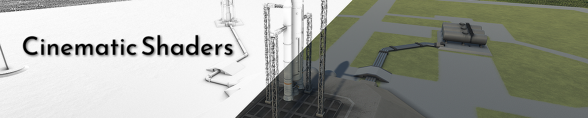
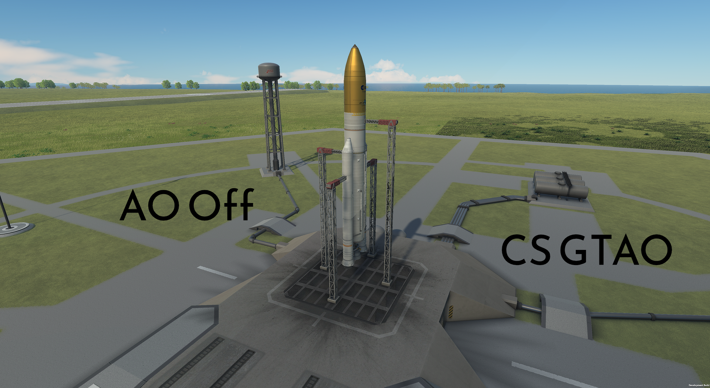
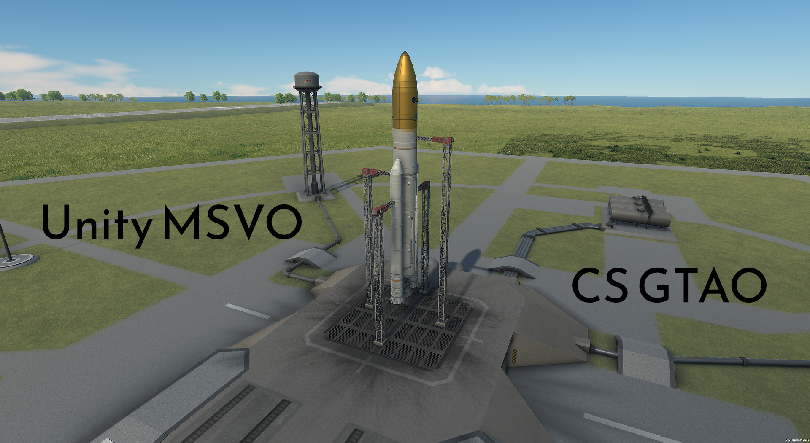
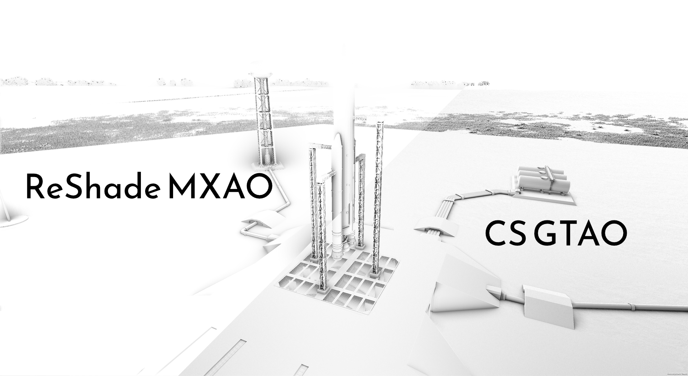

A shader mod for Kerbal Space Program 1.12 - GTAO currently available, more planned...

## Available Shaders

- **GTAO (Ground-Truth Ambient Occlusion)** – Horizon-based occlusion with normal-aware filtering

## Screenshots and Comparisons

Note that GTAO may not provide the more dramatic, soft shadows MSVO can - you can enable both, and use both, if you want!  MSVO exposed by [TUFX](https://github.com/KSPModStewards/TUFX) for KSP.

Here you can see the difference between Cinematic Shaders GTAO and the AO provided through ReShade and the MXAO shader.  The MXAO shader is an amazing piece of work, it can provide GTAO across a wide array of titles.  The comparison here is to highlight the fact that it's easier to pull off the effect in-engine because you can get the right data from the engine directly.  MXAO rebuilds that data after the fact, inferring it from the scene - a huge technical hurdle I didn't have to cross.

## Requirements

- **KSP 1.12.x**
- **[Deferred](https://github.com/LGhassen/Deferred)** – Required for effects to function.

## Installation

Unzip the archive into your `Kerbal Space Program/` folder.

The folder structure should be: `GameData/CinematicShaders/`

## Usage

1. **Open UI**: Click the wireframe sphere icon on the toolbar
2. **Enable**: Check "Enable Ground-Truth AO" in the GTAO tab (only functional if Deferred is installed)
3. **Adjust**:
   - **Radius**: Search distance for occluders (0.5m–10m)
   - **Intensity**: Shadow strength multiplier (0.0–2.0)
   - **Shadow Spread**: Maximum pixel radius for shadows
   - **Quality**: Preset controlling sample count (Low/Ultra)
4. **Debug**: Use the "Debug Visualization" dropdown for Raw AO or normal buffer inspection

## License

MIT License – See included `LICENSE.txt` file.

## Credits

- GTAO implementation based on [XeGTAO](https://github.com/GameTechDev/XeGTAO)
